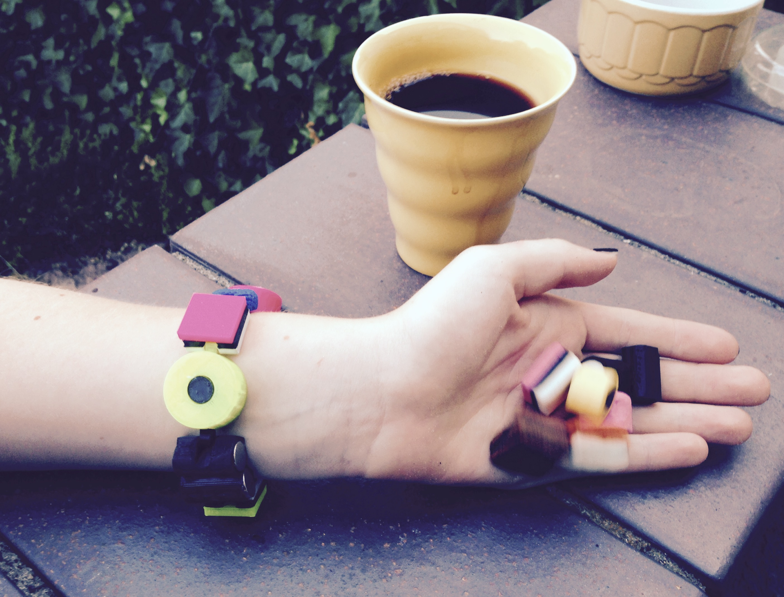

# 3dprints
Useful and not-so-useful designs for 3d-printing, lasercutting and milling
I'm moving my existing, favorite designs to this repo and will add new ones here. 

## Alsorts Bracelet
The best looking candy there is, now in a sweet and chewy PLA 3D-print.  

## Alsorts Bracelet
The best looking candy there is, now in a sweet and chewy PLA 3D-print.  

## Alien Disco Lamp
Winters are harsh on planet Pentatonia. On particularly cold days, the compounds of its toxic atomsphere deposit and crystalize. On their way down, the crystals collide and aggregate into larger and larger structures of alien shapes -pentatonian snowflakes. The snowflakes snap together in various structures, the most spectacular of which is the spiky globe that consists of twelve snowflakes. With a pixel ring in the center it becomes an alien disco lamp. Beam me down, it's party time!

