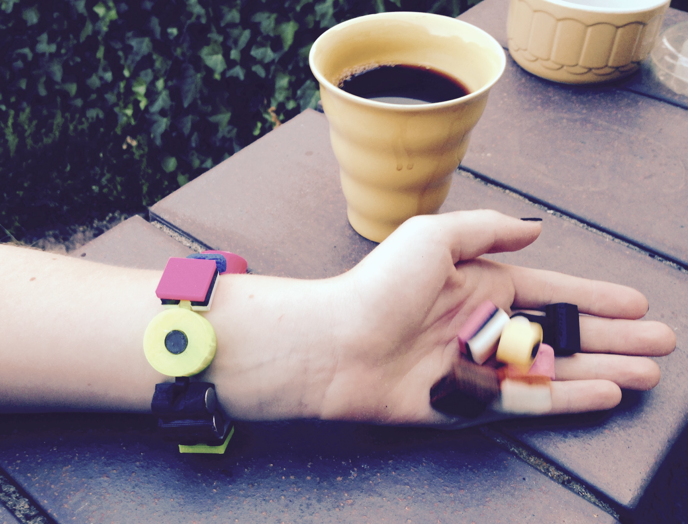
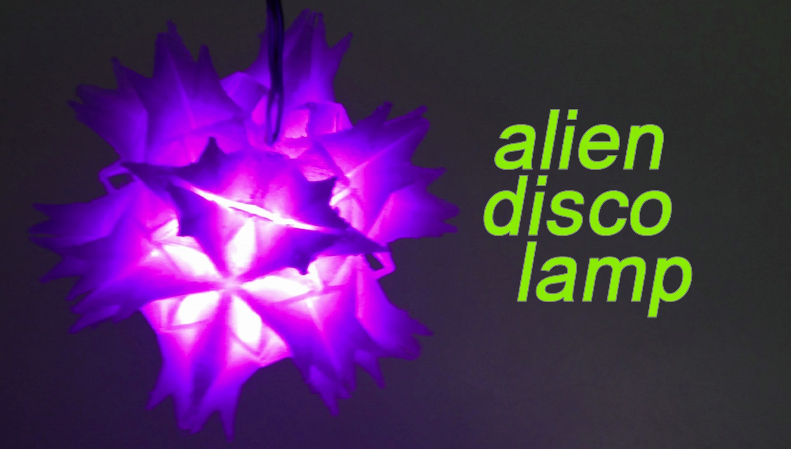
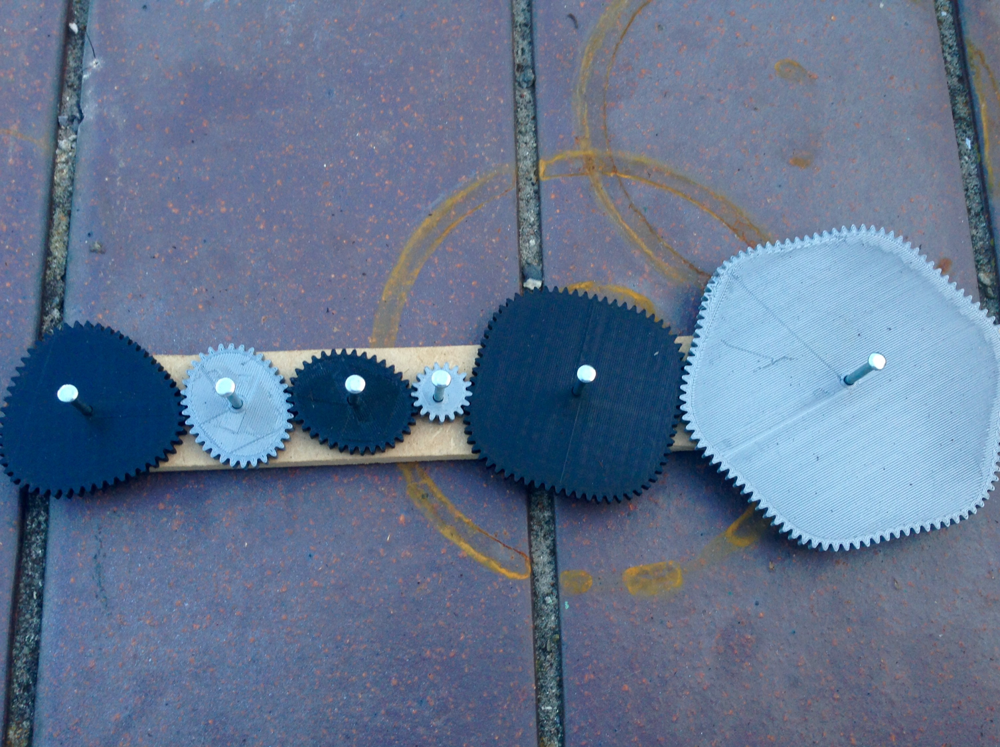
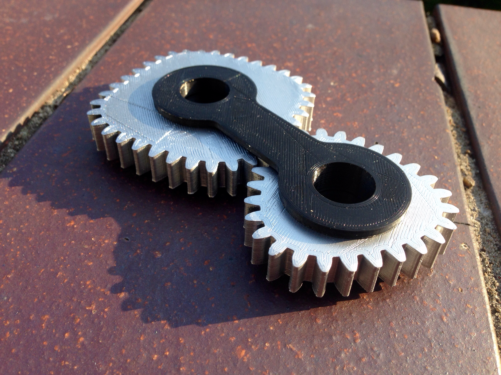
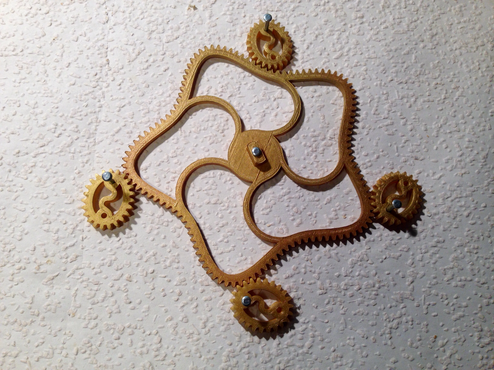

# 3dprints
Useful and not-so-useful designs for 3d-printing, lasercutting and milling
I'm moving my existing, favorite designs to this repo and will add new ones here. 

## Allsorts Bracelet
The best looking candy there is, now in a sweet and chewy PLA 3D-print.  

## Alien Disco Lamp
Winters are harsh on planet Pentatonia. On particularly cold days, the compounds of its toxic atomsphere deposit and crystalize. On their way down, the crystals collide and aggregate into larger and larger structures of alien shapes -pentatonian snowflakes. The snowflakes snap together in various structures, the most spectacular of which is the spiky globe that consists of twelve snowflakes. With a pixel ring in the center it becomes an alien disco lamp. Beam me down, it's party time!

## Non-circular Gear
Non-circular gear come in many shapes. They seem to defy the laws of motion. It really doesn't look like they are going to mesh at all, but somehow they do. That's why I think they are so cool.

# Watchamagear
Watchaagear is a fidget with non-circular gears. The shape of the fidget is paramneterized, such that it can be varied ad infinitum. In the photo: a three-lobe and a four-lobe gear with the eccentricity parameter set to 0.25. Not very eccentric :-).

# Penta Gone off the Wall
Wall decoration, which is a remix of the non-circular gears (see above).

