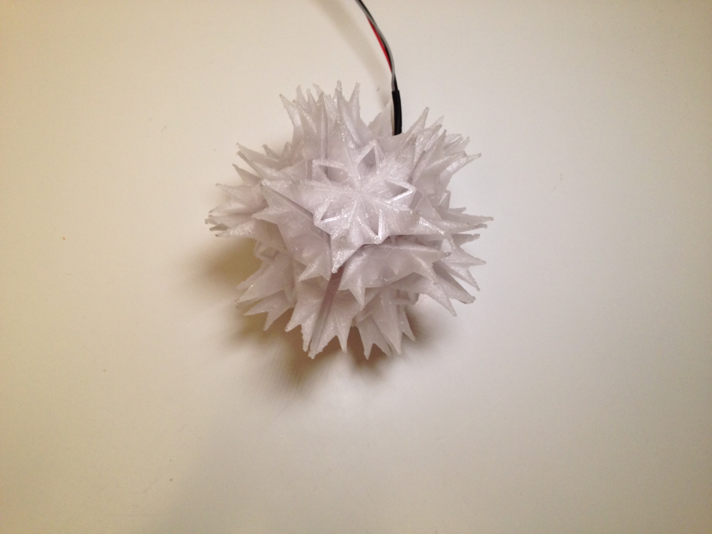
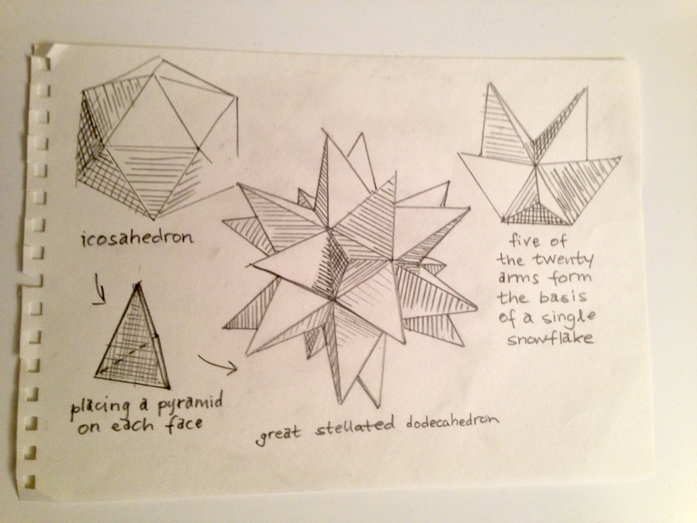
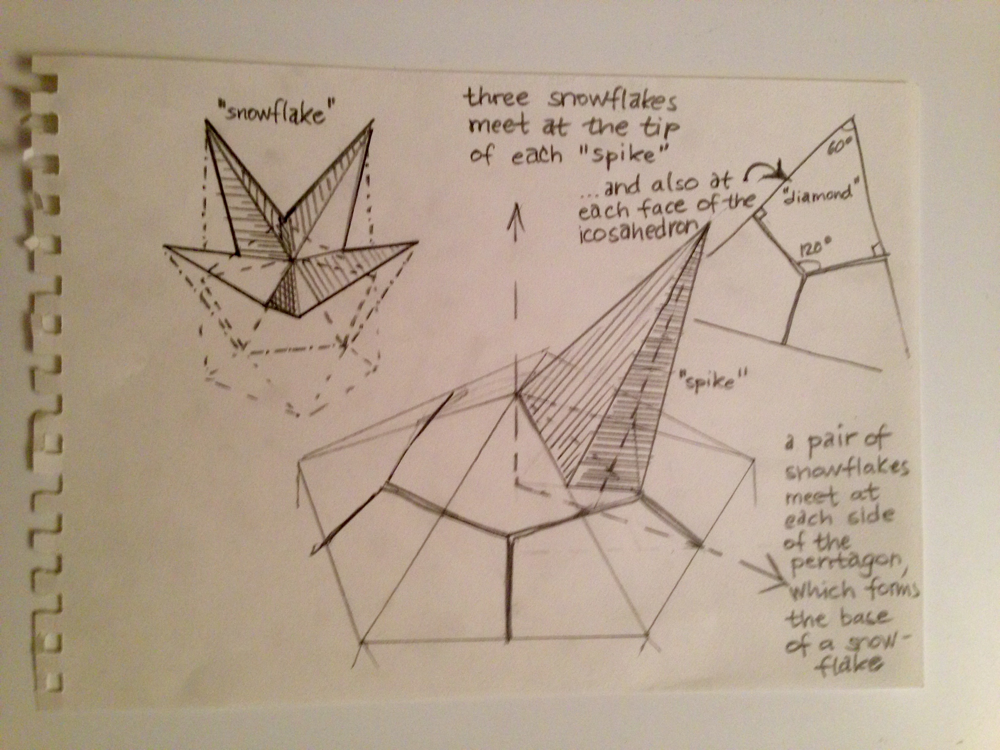
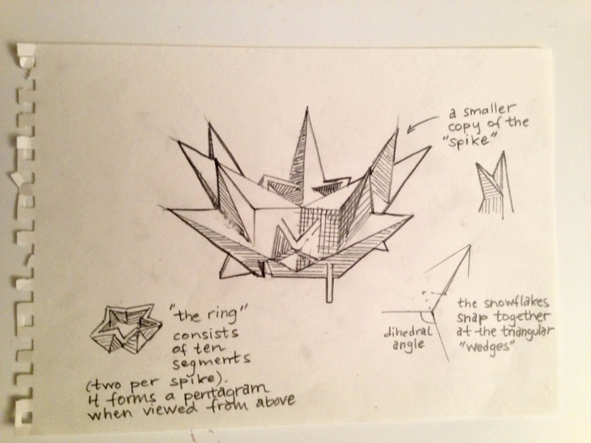

# Alien Disco Lamp

## Summary:
Winters are harsh on planet Pentatonia. On particularly cold days, the compounds of its toxic atomsphere deposit and crystalize. On their way down, the crystals collide and aggregate into larger and larger structures of alien shapes -pentatonian snowflakes. The snowflakes snap together in various structures, the most spectacular of which is the spiky globe that consists of twelve snowflakes. With a pixel ring in the center it becomes an alien disco lamp. Beam me down, it's party time!

## Post-printing
Size and amount of clearance between the parts are available as parameters (see BlocksCAD model). You can also choose to generate support. When printing in PLA I got the best result with support, but it printed fine in PETG without any support.

The construction of the snowflake is an exercise in classic geometry, It is based on the polyhedron known as the great stellated dodecahedron, which is what you get if you place pyramids on each of the twenty faces of an icosahedron. A group of five such pyramids/faces form the basis of the snowflake.

Three snowflakes meet at each face of the icosahedron, which means that each of the snowflakes's five "spikes" corresponds to one third of a "pyramid". The base of the pyramid is a regular triangle and the three snowflakes meet at its center. We call the shape of the spike's base a diamond. 

A total of twelve snowflakes gives us 5 x 12 = 60 spikes, each of which is a "pyramid" cut in three. Let's see 60/3 = 20, yeah, that should match the number of pyramids on the stellated polyhedron and the number of faces the icosahedron, which we started from.

The base of the snowflake is flat and forms a pentagon. Two snowflakes meet at each edge of that pentagon. This is where we are going to attach the snowflakes to each other. The pentagons form the faces of the dodecahedron, which is inscribed in the stellated polyhedron. In particular, this means that the snowflakes meet at an angle that is about 116 degrees, the dihedral angle of a dodecahedron.

We started out from an icosahedron, which has twenty triangular faces and twelve corners; five faces meet at each corner. By interchanging the roles of the faces and the corners, we instead got the dual polyhedron, the dodecahedron with twelve faces that are pentagons and twenty corners, at each of which three faces meet.

To make the shape a little bit more complex and interesting two extra features were added: a smaller copy of the "spike" and a star-shaped "ring". Just for looks!

The triangular "wedges", however, play an important role; they form the hinges by which the whole structure snaps together. At each of the five sides of the base there is a "wedge" and a socket for the wedge of another snowflake.

Happy printing!
