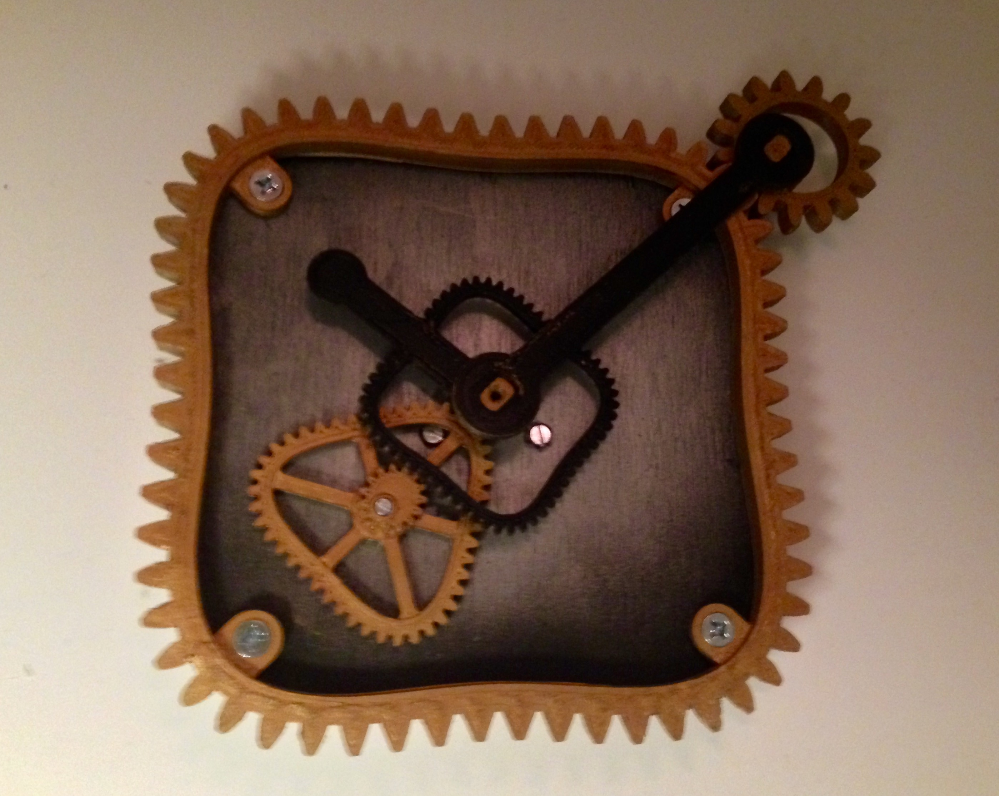
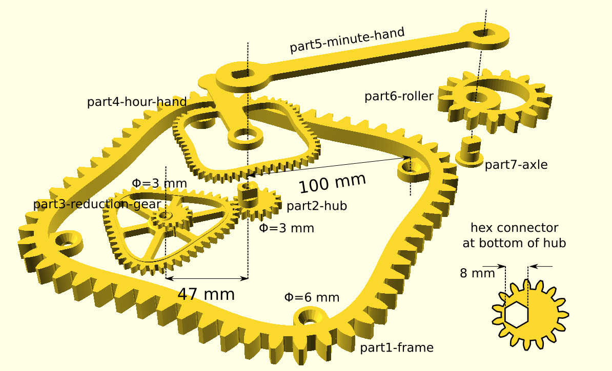

# Cuckoo Clock Factory

## Summary:
The Cuckoo Clock Factory got hold of a stock of surplus gear, but none of them were round...

## Post-printing

The minute hand is attached to the hub. I put a cheap stepper motor on the back. It makes one turn per hour in tiny steps. The hub drives the "triangular" reduction gear, which makes one turn every three hours. The "square" gear makes one turn every twelve hours and the hour hand is attached to it.

At the end of the minute hand there is an elliptic gear, which rolls on the outside of the frame.

On the back of the hub there is a hex connector. This is where the stepper motor is attached. A more elaborate clockwork could be substituted for the stepper. Do you feel like giving it a shot?

## License

License CC BY, Cuckoo Clock Factory by GitHub user carlvp is licensed under the Creative Commons - Attribution license.
