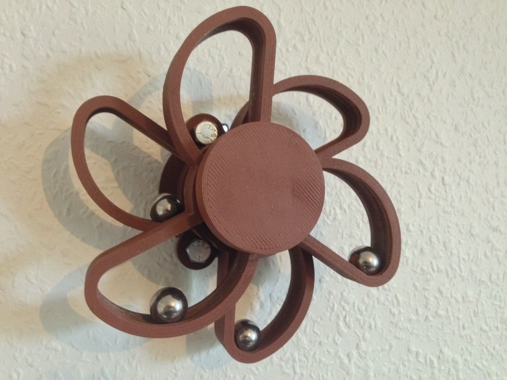
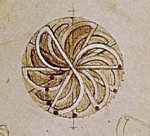

# "Leo" overbalanced wheel

Summary:
A decorative overbalanced wheel, in the spirit of Leonardo da Vinci. In particular I looked closely at this beautiful design.

The balls roll away from the center for half of the wheel's rotation and closer to the center for the other half. The inventor was hoping that the torque of the off-center balls would be sufficient to lift the other ones. However, in his notebook from 1494 he concluded that perpetual motion is as hopeless as Alchemy. In particular he expressed, what would (200 years later) become known as Newton's 3rd Law of Motion: to any action there is always an opposite and equal reaction.

## Assembly

Four parts:

* A hub 
* Two rototors: one with and one without bearings. The rotors are glued together.
* A top disc, which is press fit onto the hub. It is the end stop, which prevents the rotors from falling off the hub. 

Additional hardware:

* 3 bearings (608 "skate bearings").
* 3 nuts and bolts of about 8mm diameter and 20mm length. I used 5/16" X 3/4" UNC. M8 works as well.
* 4 steal balls. I used 18 mm balls. The tracks are 20mm wide.
* Nails

The hub was fasten onto the wall with nails. There are two tracks (for the steal balls) across the hub. The tracks should be slightly sloped (left-to-right) -so that the balls don't get caught in the middle of the hub. For this reason, the nail holes are slightly offset such that if at "twelve o'clock" the tracks get a 3 degree slope.

## License
CC BY "Leo" overbalanced wheel by GitHub user carlvp is licensed under the Creative Commons - Attribution license.
