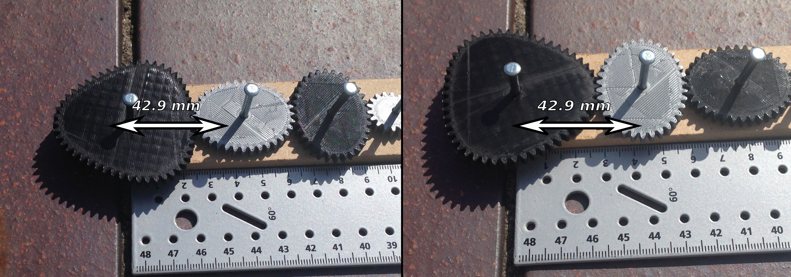

# Non-circular Gear

## Summary
Non-circular gear come in many shapes. They seem to defy the laws of motion. It really doesn't look like they are going to mesh at all, but somehow they do. That's why I think they are so cool. Here's an OpenSCAD script, which generates involute gear from elliptic curves. Also included are STL files (for 3D printing) for a collection of gear that mesh. It is possible to combine any two gears from this collection. Using the Customizer (Open in Customizer) you can create your own collection of non-circular gears, of a different shape. There are also 2D .SVG files, which are useful for laser cutting and milling.

## Parameters

All gears that are based on the same reference gear are compatible. The following parameters define the reference gear:

* Eccentricity,
* Number of teeth per lobe (must be odd), and
* Scale factor

These three parameters have to be the same for gears that are to be used together.  Thanks to Thingiverse user @samyakbhalani, to point of that an odd number of teeth per lobe is required (the gears won't mesh otherwise).

Zero eccentricity means circle (boring!) and 1 results in an unbounded shape, but the values between 0 and 1 are useful. Low values yield rounded "polygons" and high values yield "propellers".  

The other parameters are:

* Number of lobes: 1, 2, 3,...
* Axle diameter (in mm), including clearance/tolerance (zero diameter for no hole).
* Thickness of the gear (in mm)
* Normal backlash (in mm), the play that you notice when reversing the rotation of the gear. Some backlash is required or the gear jams. How much is tolerable (how much is required)? Depends on you your application, your print settings and other things.

The STL files where generated using the following parameters

Eccentricity of reference gear = 0.25
Number of teeth per lobe = 17
Scale factor = 8.25
Number of lobes = 1, 2, 3, 4, 5, 6, 8, 10
Axle diameter = 3.5
Thickness = 4
Normal backlash = 0.4

## Axle Distance

When mounting a pair of gears, the required axle distance can be determined in the following way:
Add one of the gears' minimum radius to the other one's maximuim radius (see table, below). For example, to mount the attached two-lobe and three-lobe gears next to each other, the require axle distance is

15.0 + 27.9 = 42.9, or (same result) 19.4 + 23.5 = 42.9

|| Lobes || min r || max r ||
| 1 | 6.6 | 11.0 |
| 2 | 15.0 | 19.4 |
| 3 | 23.5 | 27.9 |
| 4 | 32.0 | 36.4 |
| 5 | 40.5 | 44.9 |
| 6 | 49.0 | 53.4 |
| 8 | 66.0 | 70.4 |
| 10 | 83.0 | 87.4 |

Table 1: Minimum/maximum radius of the gears in the STL files

To get the right teeth aligned, it is easiest to rotate the gears such that the maximum radius (the lobe) meets the minimum radius of the other gear. All gears have a tooth at the maximum radius and a space at the miniumum radius.
The gears jam if misaligned (=the "wrong" teeth mesh).

As the gears rotate and mesh, the distance between their centra is constant. Well, that's the axle distance.

## Licence
Non-circular Gear
by GitHub user carlvp is licensed under the Creative Commons - Attribution license.
