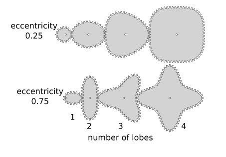

# Watchamagear

## Summary:
Make your own Whatchamagear in the Customizer (open in Customizer) or download the attached STLs. Part to print selects what to display in the Customizer (all parts, first gear, second gear, holder or "show assembled"). There are tweakable parameters. The attached STL files were made using the following parameters:

axle diameter = 30 mm  
gear thickness = 8 mm
eccentricity = 0.25 (0 for circular gear, 1 would be an unbounded shape)
number of teeth per lobe = 9
number of lobes = 3 and 4, respectively

Happy tweaking!

